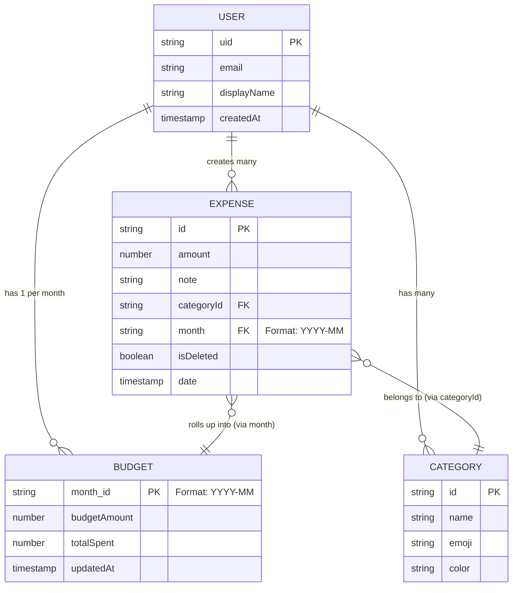

# Entity Relationship & Data Flow Diagram
## SpendWise — Student Expense Tracker

---

## 1. Entity Relationship (NoSQL Context)

Even though SpendWise uses NoSQL (Firestore), mapping the relationships is critical for understanding data integrity and UI joins.

---

## 2. Data Flow: Rendering the Dashboard

Because Firestore is a NoSQL store, we must define exactly how the client resolves foreign keys (like `categoryId` on an Expense).

### Sequence Flow (Dashboard Load)
1. User opens `/app/dashboard`.
2. **Parallel Fetch:**
   - Query A: `getDoc(users/{uid}/budgets/{currentMonth})`
   - Query B: `getDocs(users/{uid}/categories)` (Cached heavily)
   - Query C: `onSnapshot(users/{uid}/expenses, where(month == currentMonth))`
3. **Client-Side Join (Zustand Store):**
   - The Store maps `Query B` into a dictionary: `Record<CategoryId, CategoryDocument>`.
   - As `Query C` streams expenses in real-time, the UI component accesses the dictionary: `categories[expense.categoryId].emoji` to render the icon.
4. **Result:** Dashboard renders in <300ms without N+1 query problems.

---

## 3. Dealing with Referential Integrity

Since NoSQL lacks CASCADE DELETE functionality:

**Scenario:** User deletes a Custom Category (v1.1 feature).
**Problem:** Expenses tied to that `categoryId` will now be orphaned. The UI will crash when attempting to look up `categories[deleted_id].name`.

**Architectural Fix:**
1. When deleting a category, we do NOT delete the category document.
2. We perform a soft-delete: `isDeleted: true` on the Category.
3. The UI removes it from the "Add Expense" selector.
4. Past expenses retain the `categoryId`, and the UI can still look up the historic name/emoji for rendering the timeline.
